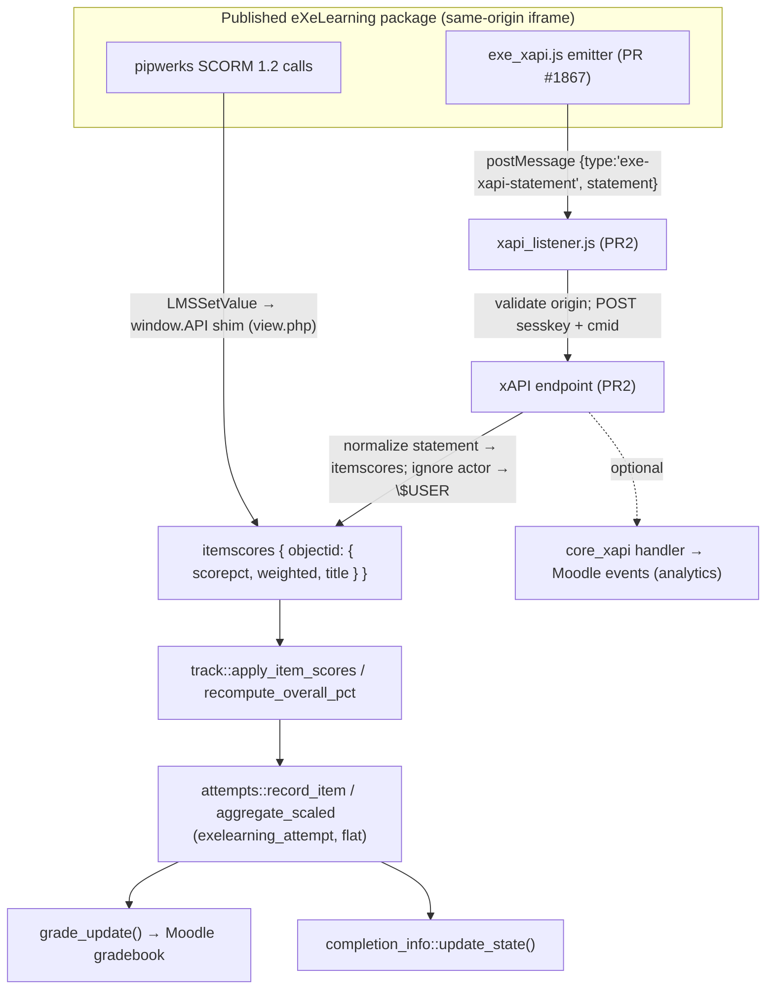

# Tracking architecture — dual SCORM 1.2 + xAPI ingestion

> Status: **target architecture** decided in DEC-0032 (Spanish ADR,
> `research/decisiones/adr/DEC-0032-ingesta-dual-scorm-xapi.md`). The xAPI channel is
> **not implemented yet** (PR2 / TAREA-015); this document fixes how it will plug in.
> See also `scorm-shim-current-flow.md` (today) and `xapi-integration-plan.md` (the plan).

## Principle

`mod_exelearning` becomes a **dual consumer**: the legacy **SCORM 1.2 shim** and the new
**xAPI emitter** (`exe_xapi.js`, eXeLearning PR #1867 — see `FTE-011`) both feed the **same
internal pipeline**. They are two ingestion *sources*, not two parallel models.

The "common internal model" the dual layer needs **already exists** and is reused as-is:

- `exelearning_attempt` — **flat** attempt table, axis `itemnumber` 0..N + `sessiontoken`
  (DEC-0007; the original header+detail design was evaluated and rejected — DEC-0007:176-186).
- `exelearning_grade_item` — stable `objectid → itemnumber` map (DEC-0017).
- `classes/local/track.php` + `attempts.php` — routing, overall recompute (DEC-0018),
  attempt recording, `grademethod` aggregation, `grade_update()`. The orchestration is the
  single shared entry point `track::ingest()` (DEC-0040): the web `track.php` and the mobile
  `save_track` web service already call it, so a future xAPI source would be a **third**
  caller of the same pipeline, not a parallel one.

xAPI therefore does **not** add a new neutral layer or header+detail tables. At most it adds
**one** optional audit/dedup table (`exelearning_tracking_events`, `statementid` UNIQUE).

## Flow

## Trust boundary

Everything the server accepts from the package is validated server-side (identical posture
to the SCORM endpoint today):

- Session + `sesskey`; resolve `cmid`/instance server-side; `require_capability('mod/exelearning:savetrack')`.
- **Ignore the statement `actor`** (the emitter sends an anonymous account by design,
  FTE-011) and attribute the grade to `$USER`.
- Map `object.id` → `objectid` and accept only objectids that already exist for **this**
  instance (DEC-0017); reject unknown ones (never create items from the client).
- Respect `gradeenabled` (DEC-0029): when grading is off there are no grade items, so
  statements route nowhere (a no-op, consistent with rejecting unknown objectids).
- Re-validate the overall on the server (spirit of DEC-0018).
- `postMessage`: the host injects `parentOrigin = <Moodle origin>` and the listener checks
  `event.origin` against the iframe `pluginfile.php` origin; `'*'`/mismatch is rejected
  (RIE-013).

## Reused vs new

| Concern | Reused (today) | New (PR2) |
|---|---|---|
| Internal model | `exelearning_attempt`, `exelearning_grade_item` | — (optional `exelearning_tracking_events` for audit/idempotency) |
| Routing / grading | `track::ingest()` (→ `apply_item_scores`, `recompute_overall_pct`, `attempts::*`, `grade_update`) | a thin `statement → itemscores` normalizer |
| Client capture | `view.php` SCORM shim; mobile app | `amd/src/xapi_listener.js`; host injects `window.exeXapi` |
| Server entry | `track.php` (SCORM web) + `save_track` WS (mobile), both via `track::ingest()` | xAPI endpoint (custom external or `core_xapi`) |
| Events | `course_module_viewed` | optional `core_xapi` handler + iDevice/package events |

## Scope

In scope: consuming `exe_xapi.js` statements via `postMessage` and grading through the
existing pipeline. **Out of scope** (documented as such, consistent with the emitter):
**cmi5** (FTE-004/009) and any dependency on an **external LRS**. SCORM 1.2 remains as the
compatibility path (DEC-0003).
