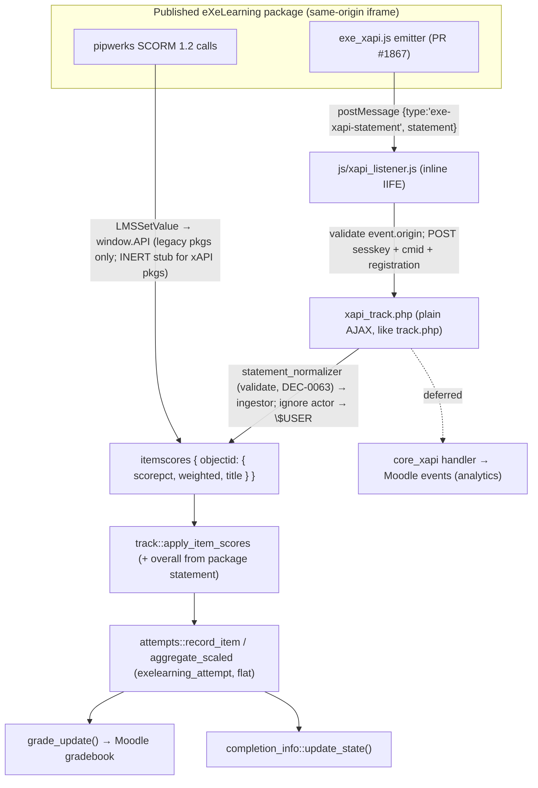

# Tracking architecture — SCORM 1.2 + xAPI ingestion

> Status: **implemented** (DEC-0032 architecture + **DEC-0064** implementation; Spanish ADRs under
> `research/decisiones/adr/`). The xAPI channel shipped in PR2 / TAREA-015 now that eXeLearning
> PR #1867 is merged (`e3b1bd13`). See also `scorm-shim-current-flow.md` (the SCORM path) and
> `xapi-integration-plan.md` (the design + what shipped).
>
> **xAPI-primary (DEC-0064):** a package that bundles `libs/xapi/exe_xapi.js` is graded via xAPI and
> its `window.API` is an **inert stub** (`js/scorm_tracker.js` `disableTracking`); legacy packages keep
> SCORM. So a given package uses exactly one grade channel — no double-counting. The listener is the
> inline IIFE `js/xapi_listener.js` and the endpoint is the plain script `xapi_track.php`
> (sesskey, mirroring `track.php`), delegating to `\mod_exelearning\local\xapi\{statement_normalizer,
> ingestor}`. The overall (`itemnumber=0`) is taken from the package statement and validated
> server-side, because per-iDevice `answered` statements carry no weight.
>
> **Kill switch:** the site-admin setting *Use xAPI grading when the package supports it*
> (`exelearning/xapiprimaryenabled`, default on; helper `exelearning_xapi_primary_enabled()`) turns the
> whole xAPI channel off without a code change — `view.php` then keeps the SCORM shim live and skips the
> listener, and `xapi_track.php` accept-and-ignores. This is **not** cmi5 and **not** an external-LRS
> integration; the endpoint is a custom grading route, not a full Moodle `core_xapi` integration (the
> `core_xapi` events/analytics handler is a deferred follow-up). SCORM 1.2 stays the compatibility path.

## Principle

`mod_exelearning` becomes a **dual consumer**: the legacy **SCORM 1.2 shim** and the new
**xAPI emitter** (`exe_xapi.js`, eXeLearning PR #1867 — see `FTE-011`) both feed the **same
internal pipeline**. They are two ingestion *sources*, not two parallel models.

The "common internal model" the dual layer needs **already exists** and is reused as-is:

- `exelearning_attempt` — **flat** attempt table, axis `itemnumber` 0..N + `sessiontoken`
  (DEC-0007; the original header+detail design was evaluated and rejected — DEC-0007:176-186).
- `exelearning_grade_item` — stable `objectid → itemnumber` map (DEC-0017).
- `classes/local/track.php` + `attempts.php` — routing, overall recompute (DEC-0018),
  attempt recording, `grademethod` aggregation, `grade_update()`. The orchestration is the
  single shared entry point `track::ingest()` (DEC-0040): the web `track.php` and the mobile
  `save_track` web service already call it, so a future xAPI source would be a **third**
  caller of the same pipeline, not a parallel one.

xAPI therefore does **not** add a new neutral layer or header+detail tables. At most it adds
**one** optional audit/dedup table (`exelearning_tracking_events`, `statementid` UNIQUE).

## Flow



## Trust boundary

Everything the server accepts from the package is validated server-side (identical posture
to the SCORM endpoint today):

- Session + `sesskey`; resolve `cmid`/instance server-side; `require_capability('mod/exelearning:savetrack')`.
- **Ignore the statement `actor`** (the emitter sends an anonymous account by design,
  FTE-011) and attribute the grade to `$USER`.
- Map `object.id` → `objectid` and accept only objectids that already exist for **this**
  instance (DEC-0017); reject unknown ones (never create items from the client).
- Respect `gradeenabled` (DEC-0029): when grading is off there are no grade items, so
  statements route nowhere (a no-op, consistent with rejecting unknown objectids).
- Re-validate the overall on the server (spirit of DEC-0018).
- `postMessage`: the host injects `parentOrigin = <Moodle origin>` and the listener checks
  `event.origin` against the iframe `pluginfile.php` origin; `'*'`/mismatch is rejected
  (RIE-013).

## Edge cases & failure modes (DEC-0064)

The statement is fully attacker-controlled (an authenticated student can POST a crafted
body straight to `xapi_track.php`, bypassing the listener), so every accepted field is
bounded server-side:

- **`registration` is sanitised and bounded.** The attempt-grouping token is cleaned to the
  `PARAM_ALPHANUMEXT` charset and capped to the `char(40)` column width — both for the POST
  body (`xapi_track.php`) and for the statement's own `context.registration` fallback
  (`statement_normalizer`, kept Moodle-dependency-free). A non-string value is dropped, never
  cast to the literal `"Array"`. Without this an over-long token overflows
  `exelearning_attempt.sessiontoken` / `exelearning_tracking_events.registration` (an HTTP
  500 on a strict DB, silent truncation on a lax one).
- **`statement.id` must be a real RFC 4122/9562 UUID** (defined version `1-8`, variant
  `8|9|a|b`). The nil UUID and other degenerate constants are rejected: `statement.id` is the
  sole idempotency key, so a client pinning a constant id would get its first statement
  graded and every later one dropped as a duplicate.
- **`result.success`** is read from its correct xAPI location (`result.success`, not
  `result.score.success`). It is informational only — the persisted grade *status* is derived
  from the verb (`passed`/`failed`/`completed`).
- **Idempotency vs genuine failures.** A repeated `statement.id` is a no-op (the
  `UNIQUE(statementid)` row already exists). `ingestor::record_event` swallows **only** that
  race — it re-checks the dedup key and rethrows any other write failure (precision/length
  violation, dropped connection) so a real audit loss is never hidden.
- **Client resend (grade never silently lost).** `js/xapi_listener.js` inspects the POST
  result: a `2xx` (or a definitive `409` attempt-cap rejection) is final; a transient
  non-`2xx`/network error is retried with bounded linear backoff. This mirrors the SCORM
  tracker's dirty-resend; the server is idempotent by `statement.id`, so a resend never
  double-grades. Without it a single transient `500` would lose that statement's grade,
  whereas the SCORM path self-heals.
- **Answered-only attempts have no overall row.** The authoritative overall (`itemnumber=0`)
  is taken from the package `passed`/`failed`/`completed` statement, emitted right after the
  per-iDevice `answered` ones. If that terminal statement never arrives (e.g. the learner
  closes the tab in the gap, now also covered by the resend above for transient failures),
  the attempt has per-iDevice rows but **no** `itemnumber=0` row, so the front-page
  participation summary, `completionstatusrequired`/passgrade completion, and the
  `aggregate_scaled(itemnumber=0)` overall reflect only package-bearing attempts. This is the
  documented cost of taking the weighted overall from the package statement (the per-iDevice
  `answered` statements carry no weight to recompute it from); the SCORM path instead writes
  an overall on every commit. Pinned by `ingestor_test::test_answered_only_attempt_has_no_overall_row`.
- **Concurrent same-attempt writes.** `attempts::record_item` is a check-then-insert guarded
  by a per-`(instance,user)` lock; on a 5 s lock-timeout it proceeds unlocked (the documented
  SCORM degraded mode it is shared with). A genuine `UNIQUE(exelearningid,userid,attempt,
  itemnumber)` collision there surfaces as a 500, now recovered by the client resend.

### Monitoring the terminal-statement loss

The answered-only edge above is the most delicate functional point, so it is observable from the
`exelearning_tracking_events` audit log (one row per processed `statement.id`, with its `verb` and
`registration`). An operator can find page-views that recorded per-iDevice `answered` statements but
never a terminal `passed`/`failed`/`completed` for the same `registration`:

```sql
SELECT a.exelearningid, a.userid, a.registration
  FROM {exelearning_tracking_events} a
 WHERE a.verb = 'answered'
   AND a.registration IS NOT NULL
   AND NOT EXISTS (
        SELECT 1 FROM {exelearning_tracking_events} t
         WHERE t.registration = a.registration
           AND t.verb IN ('passed', 'failed', 'completed'))
 GROUP BY a.exelearningid, a.userid, a.registration;
```

A non-zero, growing count means terminal statements are being lost (network, abrupt tab close, the
endpoint rejecting the package statement) and those attempts have no overall row — worth alerting on.
The client resend (above) already covers transient non-2xx; a persistent count points at something
systemic (origin/CSP, a proxy dropping the unload POST, a package not emitting the package verb).

## Reused vs new

| Concern | Reused | New (DEC-0064) |
|---|---|---|
| Internal model | `exelearning_attempt`, `exelearning_grade_item` | `exelearning_tracking_events` (`statementid` UNIQUE — audit/idempotency) |
| Routing / grading | `track::apply_item_scores`, `attempts::*`, `grade_update` | `\local\xapi\statement_normalizer` + `\local\xapi\ingestor` (thin `statement → itemscores`; overall from the package statement) |
| Client capture | `js/scorm_tracker.js` (legacy pkgs) | `js/xapi_listener.js` (inline IIFE); `\local\xapi\config_injector` sets `parentOrigin`/`actor:null` |
| Server entry | `track.php` (SCORM) + `save_track` WS (mobile) | `xapi_track.php` (plain AJAX, sesskey, mirrors `track.php`) — no `db/services.php` entry |
| Events | `course_module_viewed`, `attempt_started`/`attempt_completed` | **deferred**: optional `core_xapi` handler + iDevice/package events |

## SCORM 1.2 vs xAPI — comparison

Both channels feed the same gradebook through the same pipeline; they differ in *how the
package talks to Moodle* and *how much it can say*. This plugin uses **exactly one** channel
per package — xAPI when the package emits it, SCORM otherwise (DEC-0064).

| Dimension | SCORM 1.2 (legacy path) | xAPI (this layer) | Edge |
|---|---|---|---|
| Transport | pipwerks `window.API` shim that Moodle injects and force-inits | `postMessage` emitted natively by the package | **xAPI** — no shim, no pipwerks dependency |
| Per-iDevice detail | parsed out of the `cmi.suspend_data` string with a locale-sensitive regex | one structured `answered` statement per iDevice | **xAPI** — no brittle string parsing |
| Score field | `cmi.core.score.raw` + the suspend_data format eXeLearning serialises | typed `result.score.{scaled,raw,min,max}` | **xAPI** — breaks only if the spec changes, not the producer's string |
| Interaction richness | overall score + lesson status | verbs, per-iDevice results, context, extensions | **xAPI** — captures far more than a final score |
| Weighted overall | recomputed server-side from items (weights travel inline in suspend_data) | taken from the package `finalScore` (answered statements carry no weight) and validated | **SCORM** — weights travel with each item; xAPI leans on the package statement (parity preserved here) |
| Identity / trust | package asserts nothing; server uses `$USER` | actor is anonymous by design; server uses `$USER` | **tie** — both fully server-trusted |
| Idempotency | none (the attempt upsert absorbs repeats) | de-duplicated by `statement.id` (`exelearning_tracking_events`) | **xAPI** — exactly-once auditing |
| Offline / mobile / non-browser | no (needs the SCORM runtime in a browser) | yes (the same statements can also reach an LRS) | **xAPI** — portable beyond the embedded iframe |
| Coupling to the producer | needs pipwerks injected + the `form`/`scrambled-list` save-guard patch (DEC-0042) | none — the emitter is always-on in every export | **xAPI** — fewer serve-time mutations |
| Standard status | legacy (SCORM 1.2, 2004-era) | current (xAPI 1.0.3, forward-compatible with 2.0) | **xAPI** — modern, actively maintained |
| LMS / tooling ubiquity | near-universal, decades of support | modern standard, growing adoption | **SCORM** — widest compatibility |
| Maturity in this plugin | productive, the default since DEC-0003 | new in this layer | **SCORM** — battle-tested |
| Analytics / LRS readiness | none (data stays as Moodle grades) | statements are LRS-shaped (future `core_xapi` handler, deferred) | **xAPI** — a path to learning analytics |

**In short**

- **SCORM 1.2 is better at** ubiquity and maturity, and carries per-iDevice weights inline so
  the weighted overall needs no separate signal. It stays as the compatibility path for
  packages that predate the xAPI emitter (DEC-0003).
- **xAPI is better at** structured per-interaction granularity, dropping the fragile
  `suspend_data` regex and the pipwerks dependency, idempotent auditing, portability
  (mobile/offline/LRS), and being the modern, future-proof standard. It is the primary
  channel for packages that emit it (DEC-0064).

## Scope

In scope: consuming `exe_xapi.js` statements via `postMessage` and grading through the
existing pipeline. **Out of scope** (documented as such, consistent with the emitter):
**cmi5** (FTE-004/009) and any dependency on an **external LRS**. SCORM 1.2 remains as the
compatibility path (DEC-0003).

**This is not a full Moodle xAPI integration.** `xapi_track.php` is a *custom grading endpoint*
that ignores the statement actor and reuses the SCORM grade pipeline — it is deliberately **not**
the `core_xapi` subsystem (which binds processing to the actor identity). That trade-off is the
right one for grading; a `core_xapi` handler purely for **events/analytics** (not grading) is a
**deferred follow-up**, to be opened as a separate issue and pursued only if it adds value. The
whole channel is gated by the *Use xAPI grading…* admin switch, so a site can stay on SCORM
grading at any time. See **Manual QA checklist** in `xapi-qa-checklist.md` before release.
